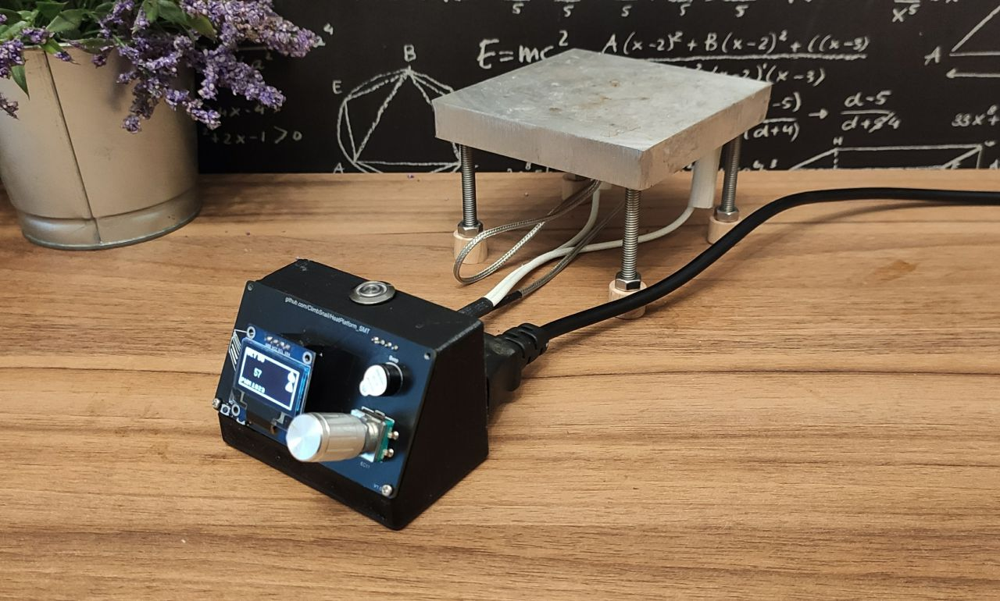
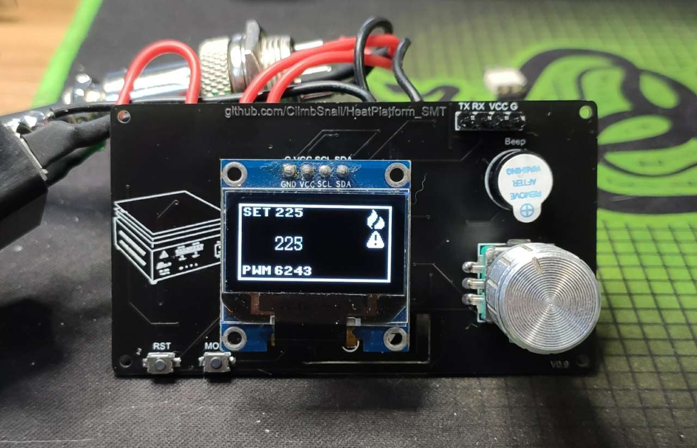
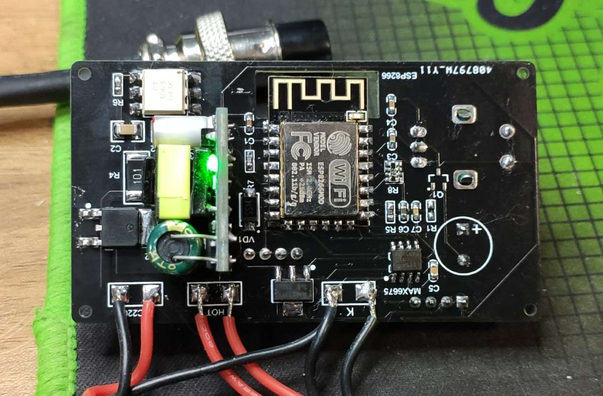

# HeatPlatform_SMT
DIY个人分体式SMT平板加热台

Github项目最新地址[链接](https://github.com/ClimbSnail/HeatPlatform_SMT) https://github.com/ClimbSnail/HeatPlatform_SMT

Gitee地址（可能不是最新的）[链接](https://gitee.com/ClimbSnailQ/HeatPlatform_SMT) https://gitee.com/ClimbSnailQ/HeatPlatform_SMT

Bilibli视频预览[链接](https://www.bilibili.com/video/BV1ky4y1m7ZF) https://www.bilibili.com/video/BV1ky4y1m7ZF

##### 免责声明
由于本项目涉及AC220电压，谨慎触碰可控硅附件的走线，只建议有经验的伙伴制作。本人不负责任何由于本项目所引发的安全问题。

### 项目起因

平板加热台可以方便手工对PCB进行贴片焊接。本人是一名北漂软件工程师，同时也是一名电子爱好者，为了搬家时方便，工具的选择总是偏向于便捷化。网络上成品的平板加热台往往较为厚重，故自己动手实现一台。

### 功能介绍
1. 使用PID控制算法，控制器的控温范围为室温~1000摄氏度。（实际温度上限需考虑加热台材料）
2. 目前稳定支持2000w功率的加热板。（可修改为支持更大功率的）
3. 屏幕使用0.96寸的OLED（SSD1306）液晶显示屏。
4. 使用旋转编码器代替按键式操作，提高用户体验。
5. 支持温度曲线的控制。（即将支持）
6. 支持通过wifi进行固件升级。[链接](ws://192.168.4.1:8266/) ws://192.168.4.1:8266/

### 工程包含
1. B站全套自作教程（等待更新）。Bilibli视频[链接](https://www.bilibili.com/video/BV1ky4y1m7ZF) https://www.bilibili.com/video/BV1ky4y1m7ZF
2. 基于ESP8266的温控系统。
3. 控温系统的硬件控制电路。
4. 控制器的外壳3D结构图。

### 交流群
添加这个qq群`148563337`，需要的朋友多的话，可以考虑一起做。

# ESP8266温控器

1. 总体使用AC220的铝加热板。控温器的温度范围是室温~1000摄氏度，当前铝加热板最好不要超过400度。
2. 主控使用的是ESP8266-12F。
3. 使用MAX6675驱动型热电偶。
4. 使用PID控制算法控制双向可控硅的导通状态。
5. 使用5脚的EC11旋转编码器作为用户操作的按钮。

### 硬件设计要点
1. 天线附近要保持足够的净空区，否则影响天线的性能。
2. bootloader启动加载程序时，GPIO0为低电平，则进入固件烧录模式。
3. 正常启动时，GPIO0高、GPIO2高、GPIO15低、EN高、RST高。
4. GPIO16不支持中断、PWM、I2C以及One-Wire功能，只能作为普通的输入、输出端口。
5. 光耦的输入触发信号电流要大于5ma，不然光耦的输出端将不能导通。
6. 光耦信号的输出端要接可控硅的1脚。

### 在线更新固件脚本
1. 使用webrepl进行更新固件(双击webrepl工具里的"webrepl.html")
2. [链接](ws://192.168.4.1:8266/) ws://192.168.4.1:8266/（链接加热控制器的wifi后方可链接）
3. 密码预设为`88888888`（在config.json文件中已注明）

### 控制器安装说明
1. 热电偶选择K型，最好选择带金属外皮的。
2. 加热台推荐使用铝加热台（纯电阻稳定）。
3. 航空头推荐使用GX16-8的（GX12安全间距不够，8脚是为了后期升级准备）。
4. `AC220`标识的接口连接AC220V的市电。不分零线火线（建议靠外侧的焊盘接火线）。
5. `HOT`是连接加热板的接口，随意接，不分正负。
6. `K`为连接K型热电偶的接口，靠近`AMS1117`稳压芯片那端为负极，改处也是同时用来接地使用（也可不接地）。
7. 航空头接线标准推荐。
	* 2、8脚接GND。
	* 1脚接热电偶正极。
	* 3、4目前留空。
	* 5目前留空。
	* 6、7接加热板供电线。

### 固件刷写
##### 完全刷写
1. 使用USB-TTL下载器链接板子的下载接口（已标识引脚，RXD TXD需要反接）。
2. `uPyCraft`是代码编写工具，同时也是固件刷写工具，打开`uPyCraft`工具，会提示安装字体（随意安装就行）。
3. 打开软件后，选择工具栏`Tools`->`BurnFirmware`，打开固件烧录的提示框。
	* `board`选择`esp8266`
	* `burn_addr`保持默认
	* `erase_flash`可以选择`yes`
	* `com`选择你TTL下载器的`com口`
	* `Firmware_Choose`中选择`Users`，然后点击`Choose`去选择`Firmware`文件夹中找后缀名为`bin`的固件。
4. 点击`OK`后，弹出刷写固件的页面。
5. 可以看到进度条始终不动。这时按住控制板上的旋钮，接着按下`RST`键（之后松开），紧接着松开刚刚按住的旋钮。这时候可以看到`EraseFlash`进度条开始变化了。
6. 等`EraseFlash`进度条走完，会发现`Burn`进度条卡住了，这时候再按住旋钮，然后再按一下`RST`松开，之后再松开旋钮按键，等进度条走完就刷写成功了。
7. 选择`Tools`->`Serial`中下载器对应的端口之后，下方输出区出现`>>`就表示`uPyCraft`工具自动连接了我们的控制器，即表示第6步的固件刷写过程是成功的。
8. 上传代码文件：双击`uPyCraft`工具左侧的`workSpace`文件夹（第一次），会让选择一个文件夹，这时我们浏览到`Software`文件夹的上级目录就行。随后点击`File`->`reflush`刷新下左侧的文件目录。再次点开`workSpace`就可以看到`Software`里的程序文件了。
9. 双击打开任意除`main.py`外的文件，点击`Tools`->`Download`，若上传成功 可以在下方的输出区看到`download ok`字样。重复此过程，使`Software`中的文件依次上传。
10. `uPyCraft`工具左侧的`device`目录中显示的是当前控制器中已有的程序，由此可以判断文件是否上传成功。在等到上传结束，最后再上传`main.py`的文件。
11. 完成。控制板接上铝加热板就可以工作了。当然不需要铝加热板也可以简单接上oled屏幕，重新上电或者按下RST复位，看oled是否正常显示。

##### 更新程序
更新程序是建立在之前进行过_"固件刷写"_操作。

按住控制器上的`MODE`按键，然后按下`RST`松开，`MODE`按键需等待背部ESP8266的指示灯常亮`（5-7s）`左右再松开，控制器即可进入程序更新模式。可跳过前6步骤，直接从第7步开始 更新想要更新的程序文件。

### 资料
[PID动画演示](https://rossning92.github.io/pid-simulation/)

### 学习资料传送门
1. [教程 in Github](https://github.com/lvidarte/esp8266/wiki)
2. [ESP8266固件](http://micropython.org/download#esp8266)
3. [uPyCraft IDE](http://docs.dfrobot.com.cn/upycraft/)
4. [官方参考文档](https://docs.micropython.org/en/latest/esp8266/quickref.html#pins-and-gpio)
5. [MicroPython API](https://makeblock-micropython-api.readthedocs.io/zh/latest/library/)
